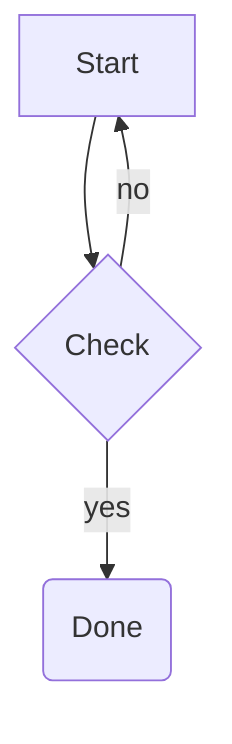
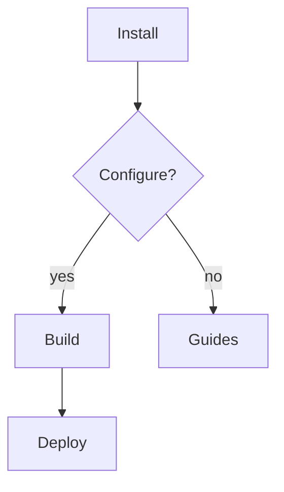
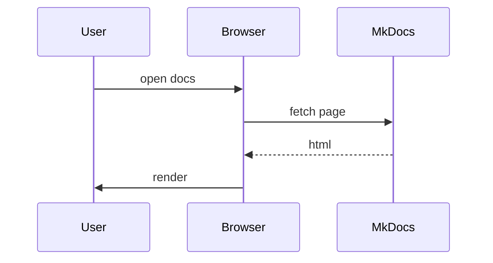
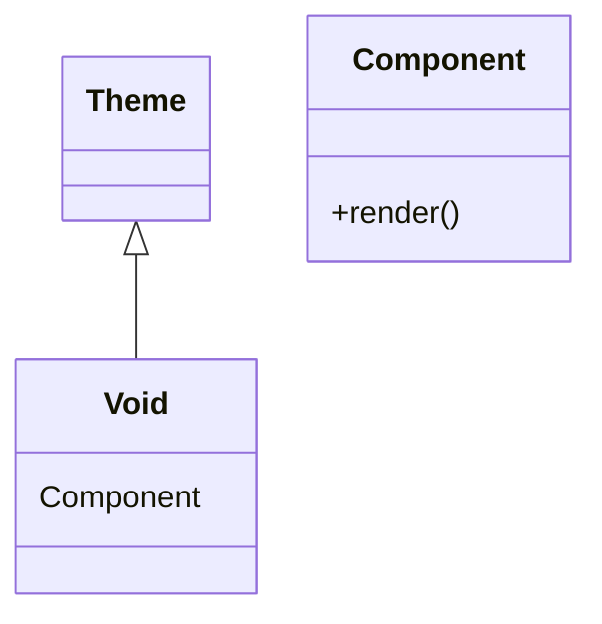
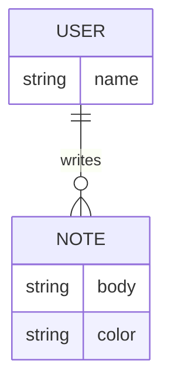
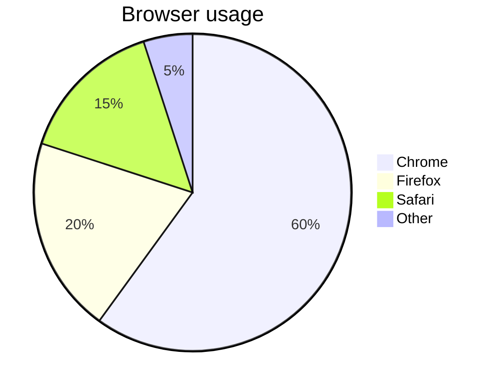

# Diagrams (Mermaid)

Void renders fenced `mermaid` blocks through [Mermaid.js](https://mermaid.js.org)
loaded from a CDN. Diagrams are themed to match your light/dark palette and
draw inside a glass card.

## Usage

````markdown

````

## Examples

### Flowchart



### Sequence diagram



### Class diagram



### ER diagram



### Pie chart



## Theme

Diagrams use the `base` Mermaid theme with token colors that track the palette.
Switch light/dark and the diagram re-renders automatically with matching colors.

## Configuration

The `mermaid` fence is enabled in `mkdocs.yml`:

```yaml
- pymdownx.superfences:
    custom_fences:
      - name: mermaid
        class: mermaid
        format: !!python/name:pymdownx.superfences.fence_code_format
```

Mermaid is only downloaded when a page actually contains a `.mermaid` block.
